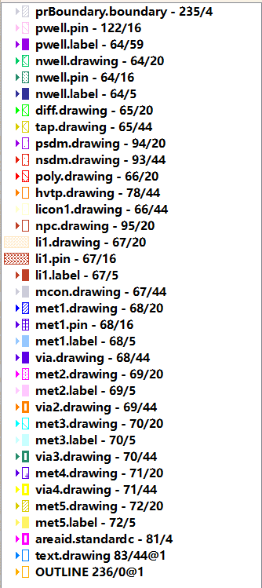

<!--
 * @Author: ka1shu1 cwh979946@163.com
 * @Date: 2026-04-06 20:10:19
 * @LastEditors: ka1shu1 cwh979946@163.com
 * @LastEditTime: 2026-04-06 20:11:08
 * @FilePath: \AICAD_Research\docs\notes\GDS3D\klayout.md
 * @Description: 这是默认设置,请设置`customMade`, 打开koroFileHeader查看配置 进行设置: https://github.com/OBKoro1/koro1FileHeader/wiki/%E9%85%8D%E7%BD%AE
-->

这是一张非常典型且信息量巨大的截图！结合你之前提到的 `sky130`，我可以非常确定地告诉你：**这个 GDS 文件是通过开源 EDA 工具链（如 OpenLane / OpenROAD）自动布局布线生成的数字电路版图，或者是一个标准单元库（Standard Cell Library）。**

在这个截图中，所有图层的名字都是**纯黑色实体字**，这印证了我们上一条说的：**你已经开启了“隐藏空图层”功能，现在列表里显示的，是这个 GDS 文件中真正包含了图形数据的层。**

为了让你看懂这座“芯片大厦”是怎么盖起来的，我按照**从底层到顶层的物理结构**，为你把这些层分门别类地解析一下：

---

### 1. 宏观边界层 (大厦的红线与地基)
这些层不是真实的物理材料，而是给 EDA 工具看的“虚拟边界”。
*   **`prBoundary.boundary - 235/4`**: **P**lace & **R**oute Boundary（布局布线边界）。它规定了自动布线工具只能在这个框框里面摆放器件和走线。
*   **`OUTLINE 236/0@1`**: 整个模块或芯片的外围轮廓线。
*   **`areaid.standardc - 81/4`**: 标记这里是摆放“标准单元（Standard Cell）”的区域。

### 2. 硅衬底与阱区层 (地下室)
这是在纯硅片上注入离子形成的导电区域，是晶体管的基础。
*   **`pwell... (122/16, 64/59)`**: P型阱（用于制造 NMOS 晶体管）。
*   **`nwell... (64/20, 64/16, 64/5)`**: N型阱（用于制造 PMOS 晶体管）。
    * *注：这里包含了 `.drawing`(绘制图形), `.pin`(引脚), `.label`(文本标签)。*

### 3. 器件核心层 (一楼：晶体管开关)
真正的晶体管就是由下面这几层交叠产生的：
*   **`diff.drawing - 65/20`**: Diffusion (扩散区/有源区)。也就是真正暴露硅面、形成源极和漏极的地方。
*   **`tap.drawing - 65/44`**: 衬底接触/阱接触。为了防止芯片发生闩锁效应（Latch-up），用来给硅片接地的触点。
*   **`psdm / nsdm - 94/20, 93/44`**: P+ 和 N+ 离子注入区。决定了下面的 diff 到底是 P型还是 N型。
*   **`hvtp.drawing - 78/44`**: 高压厚氧层。如果有这个层，说明这里面用了支持较高电压（比如 3.3V）的晶体管。
*   **`poly.drawing - 66/20`**: Polysilicon (多晶硅)。**极度重要！** 这就是晶体管的“栅极 (Gate)”，相当于水龙头的开关。Poly 跨过 diff 的地方，就形成了一个晶体管。

### 4. 局部互连层 (二楼：Sky130 的特色)
**⚠️ 这是 SkyWater 130nm 工艺的一个巨大特色！** 大多数工艺直接从 Poly 就往上打孔连接 Metal 1 了，但 Sky130 在底层多了一个专门做短距离连接的层。
*   **`licon1.drawing - 66/44`**: Local Interconnect Contact。打在 Poly 或 Diff 上的底层通孔。
*   **`li1.drawing - 67/20`**: **Local Interconnect 1 (局部互连层)**。这是一种钛氮材料，它比真正的金属层还要靠下，专门用于在一个逻辑门（比如与非门）内部把晶体管连起来，非常节省空间。
*   `li1.pin` / `li1.label`: li1 层的引脚和标签。

### 5. 金属互连层 (三楼及以上：复杂的立交桥)
这就是芯片里的主要“导线”，用来把各个逻辑门连接成复杂的电路。按照从下往上的顺序交替堆叠（金属 -> 通孔 -> 金属 -> 通孔...）：
*   **`mcon.drawing - 67/44`**: Metal Contact（金属接触孔）。把下层的 `li1` 连到上层的 `met1`。
*   **`met1.drawing - 68/20`**: **Metal 1 (第一层金属)**。通常用于横向走线。
*   **`via.drawing - 68/44`**: Via 1 (第一层通孔)。连接 Met1 和 Met2。（*注意：Sky130 官方就把第一个 via 叫 `via`，往上才叫 `via2`*）。
*   **`met2.drawing - 69/20`**: **Metal 2 (第二层金属)**。通常用于纵向走线。
*   **`via2.drawing - 69/44`**: Via 2 (第二层通孔)。
*   **`met3.drawing ... met4 ... met5`**: 第三、四、五层金属及对应的通孔。数字越大，金属越粗，通常用于跑全局的电源线 (VDD/GND) 或高频时钟线。

---

### 🕵️‍♂️ 高级洞察：为什么你的 Datatype 是 20 和 44？

细心的你可能会发现，正常的画图层（`.drawing`）数据类型应该是 `/0` 才对，**为什么你截图里的 `.drawing` 全是 `/20`，而通孔全都是 `/44` 呢？**

**答案：** 这暴露了你这个 GDS 文件的来源。
在原生 Sky130 晶圆厂的规范中，Metal 1 的画图层确实是 `68/0`。
但是，如果你使用了 **OpenLane** 或 **Magic** 等工具将 LEF/DEF 文件（数字布线格式）转换成 GDS 时，这些工具会使用自己的一套**映射规则 (Mapping)**：
*   它们习惯把绕线工具画的实际金属线映射为 **`/20`**。
*   把绕线工具打的通孔映射为 **`/44`**。

这就是为什么你会看到 `met1.drawing - 68/20`。你导入的这个 `.lyp` 文件，正是专门为了配合这种 EDA 工具输出结果而定制的“翻译字典”。

在 SkyWater 130nm (sky130) 工艺中，**`npc`** 全称是 **Nitride Poly Cut**（氮化硅多晶硅切割层 / 氮化硅开孔层）。

它是这个特定工艺库里一个**非常特殊且关键**的层。为了让你听懂它是干嘛的，我们需要稍微了解一点点芯片制造工艺（不用怕，我用通俗的比喻来解释）：

### 1. 为什么需要 `npc` 这个层？（物理原理）
在制造芯片时，`poly`（多晶硅，也就是晶体管的栅极开关）上方通常会覆盖一层**氮化硅（Nitride）**作为保护层或阻挡层（比如用来做侧壁或者阻挡硅化物）。

这就会导致一个问题：如果你想用 `licon1`（底层通孔）去连接 `poly`，就会被这层绝缘的氮化硅给挡住，导致“接触不良”或者完全断路。

**打个比方：**
`poly` 就像是一根**带绝缘皮的电线**。如果你想把另一根导线接在它上面，你必须先用小刀把绝缘皮剥掉一块。

**`npc` 层，就是那把“小刀”。**
在版图上画了 `npc` 的区域，就等于告诉光刻机：“请在这里喷射腐蚀气体，把包裹在多晶硅上面的氮化硅保护层给挖穿！”

### 2. 它在版图上是怎么配合使用的？（设计规则）
在 Sky130 的设计规则（DRC）中有一条铁律：
**只要你的底层通孔 (`licon1`) 是打在多晶硅 (`poly`) 上面的，那么这个通孔的周围必须包围着 `npc` 层。**

如果你单独看晶体管的版图，你会发现这三者的关系就像汉堡包：
*   最下面是 **`poly`** (多晶硅连线)
*   中间是 **`npc`** (在保护层上开的洞，通常比通孔稍微大一点)
*   最上面是 **`licon1`** (真正填进去导电的金属柱子)

如果你忘了画 `npc`，DRC 检查就会报错；如果真的强行制造出来，你的芯片就会因为栅极连不上电而彻底变成一块砖头。

### 3. 后面的 `.drawing - 95/20` 是什么意思？
*   **`95`**: 是代工厂分配给 Nitride Poly Cut 这道工序的专用层号。
*   **`20`**: 和我们上一条提到的一样，这是 OpenLane/Magic 这种自动布局布线工具的特殊标记。在这个工具的眼中，`/20` 代表这是由工具自动生成或布线产生的一个**实际绘制图形**。

**总结：**
当你看到 `npc.drawing` 时，只要知道它是**“为了让金属柱子能成功碰到多晶硅栅极，而专门用来破除绝缘保护层的一个挖孔标记”**就可以了！

在 SkyWater 130nm (sky130) 工艺和芯片版图的语境下，**`capm`** 的全称是 **Capacitor Metal**（电容金属层）。

它的核心作用是用来在芯片内部制造一种高质量的电容器——**MiM 电容（Metal-Insulator-Metal，金属-绝缘体-金属电容）**。

为了让你完全看懂，我们还是用“造大楼”的比喻来剖析它：

### 1. 为什么需要一个专门的 `capm` 层？
在芯片里，普通的金属层（比如 `met3` 和 `met4`）之间填充的是厚厚的绝缘材料（氧化硅）。这是因为工程师**希望普通的导线之间离得越远越好**，这样可以减少寄生电容，防止信号互相干扰。

但是，如果在模拟电路（如射频电路、ADC转换器）或者电源去耦（Decap）时，我们**真的需要一个容量很大的电容**怎么办？
如果我们直接拿普通的 `met3` 和 `met4` 当正负极，因为它们离得太远，电容量会非常小，极其浪费面积。

于是，代工厂（Foundry）发明了 **MiM 电容** 结构：
他们在原本的两层金属之间，**偷偷加塞了一层极其薄的特殊金属板**，并且这层金属板和底下的金属距离非常非常近。这层专门加塞的金属，就是 **`capm`**。

### 2. 它在版图里是怎么堆叠的？（又是汉堡包结构）
在 Sky130 工艺中，MiM 电容通常建在较上层的金属之间（具体来说是 `met3` 和 `met4` 之间）。

如果你在 KLayout 里切开一个画了 `capm` 的区域，它的侧剖面结构是这样的：
*   **顶层盖子：`met4`**（第四层金属，负责把正极引出去）
*   **连接柱：`via3`**（通孔，把 met4 和底下的 capm 连起来）
*   **上极板：`capm`**（**电容金属层，也就是你看到的这个层**，通常对应层号 `89/20` 或 `89/44`）
*   **绝缘层**：代工厂在这里涂的一层极薄的绝缘材料（高K介质），这层你画不出来，代工厂会自动做。
*   **下极板：`met3`**（第三层金属，作为电容的底座和负极，把负极引出去）

### 3. 我在版图里看到它意味着什么？
如果你在你打开的 `.gds` 文件中看到了 `capm` 层（且不是灰色的，里面有图形），这说明：
1.  **你大概率不是在看一个纯数字逻辑的门电路（如与非门）。** 标准的数字单元（Standard Cell）几乎不用这种高级电容。
2.  **你可能在看一个模拟 IP（Analog IP）**，比如锁相环（PLL）、振荡器、或者某种传感器接口。
3.  **或者你在看一个去耦电容（Decoupling Capacitor / Decap）**。在复杂的数字芯片中，为了保证电源电压稳定，会在空闲的区域塞满这种电容，充当“微型蓄水池”，在芯片疯狂运算时提供瞬间的电流。

**总结：**
**`capm`** 就是一块悬浮在两层普通金属中间的**“特殊金属垫片”**，它和它正下方的金属层紧紧贴在一起，专门用来在芯片里制造大容量的电容器。